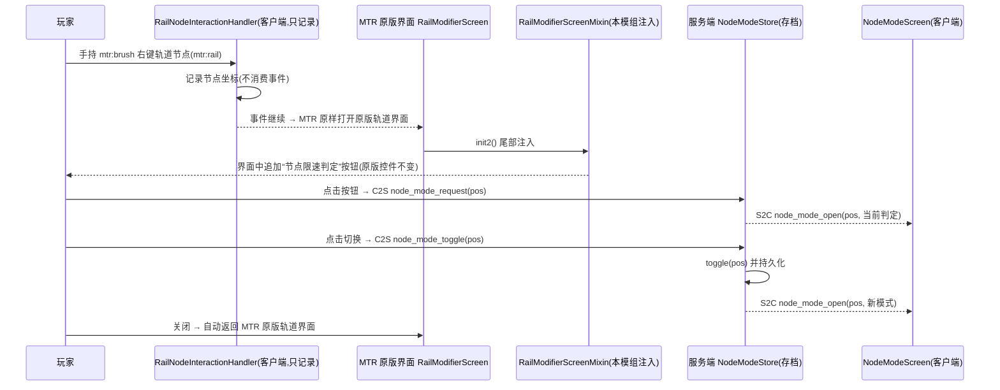

# 01 · 技术方案文档（MTR RealRail）

## 1. 背景与目标

MTR（Minecraft Transit Railway）4.0.x 的列车速度变更在**车头进入新轨道段时立即按该段限速生效**，且同一轨道上的多个信号系统（16 色信号连接器）之间**相互干扰**。本附属模组改进两点：

1. **需求一（限速变更时机后移）**：列车在**车尾完全经过轨道连接器之后**才开始变更速度；并支持用刷子右击某个轨道节点，在**MTR 原版轨道界面**中点击新增的"节点限速判定"按钮，单独把该节点切换为"车头判定/车尾判定"。
2. **需求二（多信号系统互不干扰）**：每个信号系统独立判断区间占用；速度/闭塞逻辑基于列车实际所在的信号系统执行。

目标平台：MC 1.20.1 + Forge（Architectury 架构，兼容 Fabric）；目标版本：MTR 4.0.0 正式版及以后（验证基准 4.0.5，MC 1.20.1 线的最新发行版）。

---

## 2. 现状分析（MTR 4.0.x 源码实证）

> 实证途径：解析 Modrinth 发行版 `FORGE-4.0.5+1.20.1.jar` 类清单 + 研读 Transport-Simulation-Core 仓库（发行版 4.0.2–4.0.5 复用同一内嵌 TSC jar，源码对应 commit `599d10766d0a435f8327f0f7c960039223cd38c0`，2025-09-24）与主仓库 4.0.6 分支源码。任务书中的 3.x 类名（`Train/RailwayData/RailNode/SignalBlock/RailwayDataSignalActionsModule`）在 4.0.x 中**均不存在**，已按 4.0.x 真实架构重新设计。

### 2.1 三层架构

| 层 | 包 | 职责 |
|---|---|---|
| 核心仿真（TSC） | `org.mtr.core.*` | `Rail/Vehicle/VehicleCar/VehiclePosition/Simulator/SignalModification/PathFinder`，列车物理、信号预留、路径 |
| Mod 层 | `org.mtr.mod.*` | 方块/物品/屏幕/渲染（`BlockSignalLight*`、`ItemSignalModifier`、`SignalColorScreen`…） |
| 映射层 | `org.mtr.mapping.*` | MC 版本抽象 |
| 迁移层 | `org.mtr.legacy.*` | 3.x 存档迁移（`LegacyRailNode`/`LegacySignalBlock`） |

### 2.2 列车仿真与限速（需求一前提）

- 列车 = `Vehicle`；位置 = 沿整条路径的一维 `railProgress`（指向行驶方向最前端），路径 = `vehicleExtraData.immutablePath`（`PathData` 列表，每段含起点/终点 `Position`、`startDistance/endDistance`、`speedLimit`（km/h）、`dwellTime`、`signalColors`）。
- 每 tick：`Simulator.tick → Siding.simulateTrain → Vehicle.simulate → simulateMoving`。ATO 分支：
  - `speedTarget = immutablePath.get(currentIndex).getSpeedLimitMetersPerMillisecond() * deviationSpeedAdjustment`（`currentIndex` = 车头所在段）→ **车头越过连接器即变速**（问题点）。
  - `Siding.getUpcomingSlowerSpeed(...)` 预制动：对前方更慢的段提前减速（加速方向无预判）。
  - 注：限速值存于 `PathData.speedLimit` 缓存字段（路径生成时由 `PathData.writePathCache → getRailSpeed` 从 Rail 写入，站台/折返段继承相邻可加速段限速），每 tick 从缓存读取，不实时查 Rail。
- 车长：`vehicleExtraData.getTotalVehicleLength()`（含车钩，由 `Siding.getTotalVehicleLength(vehicleCars)` 计算）；**车尾位置 = `railProgress - totalVehicleLength`**；段索引由 `Utilities.getIndexFromConditionalList(path, value)` 二分求出。
- 节点（轨道连接器）在运行时**没有独立对象**：节点 = 两段 Rail 共用的 `Position`；段起点 = `PathData.getOrderedPosition1()`（行驶方向起点）。

### 2.3 信号系统（需求二前提）

- 16 色信号连接器为**物品**（`signal_connector_<色>`，色值 = 24-bit RGB，`ItemSignalModifier.COLORS[]`，索引 0–15），通过 `SignalModification`（position1/2 + signalColorsAdd/Remove）写入 `Rail.signalColors`。
- **没有显式 SignalBlock 类**：区间 = 同色连通分量，每 tick 由列车隐式重建——`Rail.reserveRail(vehicleId, color, visited, rail, currentlyBlocked)` 沿共享端点、含同色的轨道**按颜色 DFS 预留**，状态存于 `Rail` 的四张 `Long2LongAVLTreeMap`（颜色 → vehicleId：pre/currently × 当前/Old 双缓冲，每 tick 由 `Rail.tick1` 清零重建）。
- 列车检查：`Vehicle.checkAndBlockSignal` 取当前段颜色集，向后扫描到颜色交集为空的段（区间终点），检查区间出口畅通后 `PRE_RESERVE`；`writeVehiclePositions` 对车身覆盖各段 `CURRENTLY_RESERVE`。
- **干扰点（与任务书前提一致）**：`Rail.isBlocked` 检查四张 map 的**所有颜色**、预留时遍历 `signalColors` **全部颜色** → 系统 A 的列车会占用/被拦停于系统 B 的区间。
- 信号灯不存 rail 引用，只存每侧颜色过滤集；渲染侧 `RenderSignalBase.getAspectState` 用客户端 `railIdToCurrentlyBlockedSignalColors[railId]` 与过滤集求交 → 红/绿（带 2s/4s 黄态缓冲）。此数据流天然按颜色打包，隔离后自动正确。

### 2.4 任务书前提核对结论

| 任务书假设 | 4.0.x 实际 |
|---|---|
| 轨道连接器决定速度（不同材质不同限速） | 轨道连接器仍存在（rail_connector_20…300 km/h 变体），限速存于 `Rail.speedLimit1/2`（km/h），材质样式（styles）与限速无关 |
| 信号连接器划分区间、同色连通为一段 | 部分成立：区间 = 同色连通分量；但无持久 SignalBlock 对象，每 tick 隐式重建 |
| 同一连通区间同时只能有一辆车 | 成立（`isNotBlocked` 只允许同一 vehicleId）；另有物理重叠检测兜底 |
| 速度控制与信号解耦、缺乏协调 | 成立：限速来自 PathData/Rail；信号只控制"能不能进"（stoppingPoint 制动） |

---

## 3. 总体架构设计

### 3.1 模块划分

```
┌───────────────────────── MTR RealRail (mtr.realrail) ─────────────────────────┐
│  平台层（fabric/forge）     MainFabric/MainForge → MtrRealRail.init/initClient │
│  交互层（common）          RailConnectorInteractionHandler ─ NodeModePackets ─ NodeModeScreen │
│  状态层（common）          NodeModeStore(节点模式持久化)  SignalIsolationRegistry(列车→颜色) │
│  算法层（common）          SpeedLimitHelper(边界状态机/生效限速/预制动)  RealRailConfig │
│  Mixin 层（common）        VehicleSimulateMixin  RailSignalIsolationMixin │
└───────────────────────────────────────────────────────────────────────────────┘
         注入/依赖 ↓ (compileOnly mtr-common.jar / org.mtr.core)
┌──────────────────── MTR 4.0.x（不改动本体）───────────────────────────────────┐
│  org.mtr.core.data.Vehicle（simulate/simulateMoving）  org.mtr.core.data.Rail（isBlocked/reserveRail） │
└───────────────────────────────────────────────────────────────────────────────┘
```

### 3.2 关键改动点对照表

| 原版类/方法 | 改动方式 | 改动内容 |
|---|---|---|
| `Vehicle.simulate(...)` | `@Inject HEAD` | 每 tick：更新边界跨越状态机（需求一）；登记列车所属信号颜色（需求二） |
| `Vehicle.simulateMoving` 内 `PathData.getSpeedLimitMetersPerMillisecond()` | `@Redirect` | 车头段限速 → `SpeedLimitHelper.getEffectiveSpeedLimit`（车尾/节点模式） |
| `Vehicle.simulateMoving` 内 `Siding.getUpcomingSlowerSpeed(...)` | `@Redirect` | 原版预制动 → 车尾感知预制动（TAIL 节点前不预减速） |
| `Rail.isBlocked(vehicleId, BlockReservation)` | `@Inject HEAD + cancellable` | 全颜色检查/预留 → 按注册颜色过滤（需求二） |
| （新增）节点交互 | `PlayerInteractEvent.RightClickBlock`（仅客户端，只记录坐标） | 刷子右键轨道节点 → MTR 原版界面照常打开；本模组在该界面中注入"节点限速判定"按钮（`RailModifierScreenMixin`） |
| （新增）配置持久化 | `NodeModeStore` | `world/mtrrealrail/nodes.json`；`config/mtrrealrail.properties` |

**未改动**（安全性保证）：stoppingPoint 制动分支（红灯/平台/前方占用立即减速）、物理重叠防撞（`VehiclePosition.getClosestOverlap`）、手动驾驶逻辑、客户端渲染。

---

## 4. 需求一方案：边界状态机（车尾判定）

### 4.1 核心不变量

- 车头位置 `railProgress`；车尾位置 = `railProgress - totalVehicleLength`。
- 每辆车维护 `(lastHeadIndex, pendingTailBoundary)`：
  - 车头段索引变化（跨过连接器）→ 查该边界节点模式：TAIL → `pendingTailBoundary = headIndex`；HEAD → 清空。
  - 车尾段索引 ≥ `pendingTailBoundary` → 清空（整列车已进入新段）。
- **生效限速** = pending 存在 ? 边界前一段限速（保持旧限速）: 车头段限速。
- 预制动：扫描在下一个 TAIL 节点处截断。

### 4.2 边界情况

| 情况 | 处理 |
|---|---|
| 列车恰好停在连接器上（头在前段、尾在后段） | pending 未清除 → 保持旧限速，符合"整列车进入后才变更" |
| 出库/首 tick | `lastHeadIndex=-1` 不触发跨越检测；pending 默认 -1 |
| 折返（turnback，reversed 翻转） | 路径方向不变（railProgress 递增、`getOrderedPosition1` 已按 reversePositions 定向），状态机无需特判；索引回退防御性清空 pending |
| 连续跨越（列车比段长） | 逐边界处理：HEAD 边界立即清除 pending（旧延迟不复活旧限速） |
| 平台/侧线段（PathData.speedLimit 由相邻可加速段继承） | 与普通段同样处理，无特殊分支 |
| 长列车跨多段 | pending 只保留最近一个 TAIL 边界；HEAD 边界立即生效 |

---

## 5. 需求二方案：信号系统隔离

### 5.1 归属判定

列车"实际所在的信号系统" = **车身覆盖各轨道段 `signalColors` 的并集**（每 tick 由 mixin 计算写入注册表）。TTL 10s：列车被移除后自动失效；未注册/过期回退原版全颜色逻辑。

### 5.2 隔离点

`Rail.isBlocked` 过滤后：
- **检查**：仅当"所属颜色"中存在被其他车辆预留的颜色 → 拦停。
- **预留**：仅预留所属颜色（`reserveRail` 本身按颜色递归，不触碰其他系统）。
- 空颜色集（车在无信号轨道）→ 不受信号约束、不预留。
- 物理防撞机制不受影响：两列车即使在"不同信号系统"下也不会相撞。

### 5.3 一致性说明

- 信号灯显示：`SignalBlockUpdate` 按 rail 打包各颜色占线状态 → 客户端过滤集求交，隔离后显示正确。
- 红石手动封锁（`Rail.blockRail`）与信号修改器写入（`applyModification`）不受影响。

---

## 6. 按节点切换判定：在 MTR 原版界面中追加按钮

需求：刷子右击轨道节点必须**先进入 MTR 原版界面**（轨道形状 / 轨道样式），原版功能不变；在该界面内通过一个独立按钮跳转到"节点限速判定"界面。

数据流：



- 存储：`Set<"x,y,z">`（TAIL 集合），其余节点取全局默认（config `default_node_mode=TAIL`）。
- 右键交互**完全交还 MTR**：本模组只记录坐标，不调用 `setUseBlock/setUseItem`，原版界面与原版逻辑零改动。
- 注入方式：`@Mixin(targets = "org.mtr.mod.screen.RailModifierScreen")`（字符串 targets，不强制加载目标类）
  + `@Inject(method = "init2", at = @At("TAIL"))` + `@Shadow addChild(ClickableWidget)`；按钮用 MTR 自有控件
  `ButtonWidgetExtension` 创建，位置与原版控件行（y=0 / y=25）错开。
- 稳健性：独立 mixin 配置 `mtrrealrail.railgui.mixins.json`，`required=false`、`defaultRequire=0`、仅 `client`；
  MTR 版本变动导致注入失败时只记日志，不影响游戏与其他功能。
- 编译依赖：`libs/mtr-compile.jar` 由 `setupLibrary` 从发行 jar 提取 `org/mtr/core`、`org/mtr/mod`、
  `org/mtr/mapping`、`org/mtr/libraries`（仅 compileOnly，运行时由 MTR 本体提供）。

---

## 7. 服务端数据流总览（每 tick）

```mermaid
flowchart TD
    A[Simulator.tick → Siding.simulateVehicles] --> B[Vehicle.simulate]
    B --> M1[VehicleSimulateMixin@HEAD]
    M1 --> M1a[SpeedLimitHelper.updateState<br/>边界跨越检测/车尾通过判定]
    M1 --> M1b[计算车身颜色并集<br/>→ SignalIsolationRegistry]
    B --> C[simulateMoving]
    C --> R1[Redirect: getSpeedLimitMetersPerMillisecond<br/>→ SpeedLimitHelper.getEffectiveSpeedLimit<br/>车尾/节点模式生效限速]
    C --> R2[Redirect: getUpcomingSlowerSpeed<br/>→ 车尾感知预制动]
    C --> D[railBlockedDistance 安全检查<br/>信号→Rail.isBlocked 物理→VehiclePosition]
    D --> RX[RailSignalIsolationMixin<br/>按注册颜色检查/预留]
    B --> E[writeVehiclePositions<br/>CURRENTLY_RESERVE 车身占用]
    E --> RX
    RX --> F[Rail 四张颜色→vehicleId 表]
    F --> G[Rail.tick1 → SignalBlockUpdate<br/>→ 客户端信号灯渲染]
```

客户端仅做同步与渲染，本模组无客户端侧仿真逻辑。

---

## 8. 验证方案

1. **编译级验证**：`gradlew :forge:build` 通过 = Mixin 目标签名匹配（`@Redirect/@Inject` 目标不存在会编译/应用失败）。
2. **单机验证**（见文档 03 §6 清单）：限速变更时机、节点 GUI 切换与持久化、双色信号隔离、平台/折返/红灯回归。
3. **多版本验证**：4.0.0 正式版（2025-07-31）起为最低支持版本（`simulateMoving`/`getUpcomingSlowerSpeed` 自 prerelease.2 引入）；对 4.0.0/4.0.1/4.0.2/4.0.3/4.0.4/4.0.5 逐个替换 MTR 版本构建 + 冒烟测试（4.0.2–4.0.5 复用同一 TSC jar，签名稳定）；beta 系列按文档 04 指引适配。
4. **边界场景自动化**：长列车（>段长）、停在连接器上、折返、出库首 tick、跨维度坐标冲突（文档 04 已知限制）。
